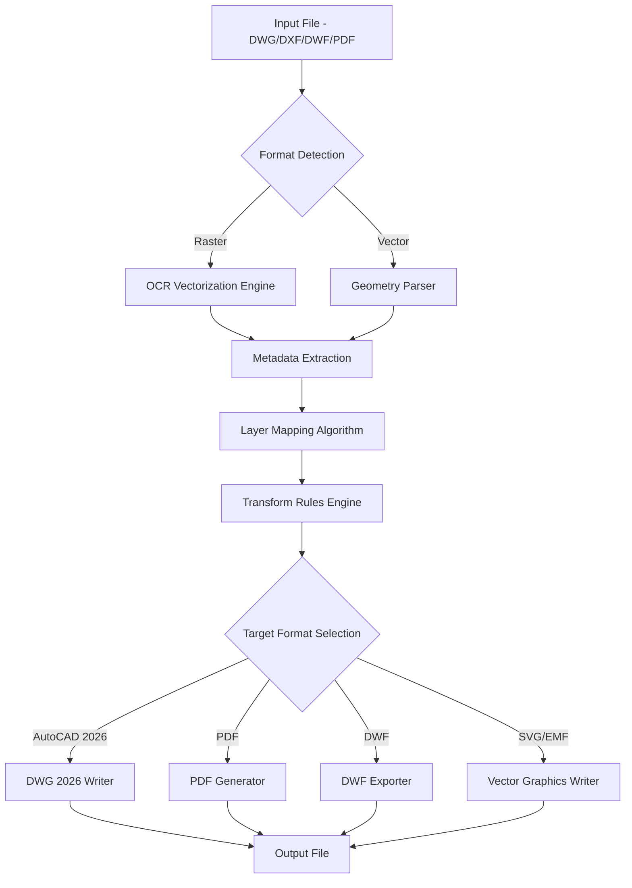

# Acme CAD Converter 8.10.6.1560 – Advanced Document Transformation Suite

Welcome to the next-generation CAD file transformation platform. Acme CAD Converter 8.10.6.1560 is not merely a converter—it is a bridge between design ecosystems. Built for architects, engineers, and digital craftspeople, this tool translates proprietary blueprint languages into universally readable formats. Whether you are migrating legacy drawings to modern standards or preparing deliverables for cross-platform collaboration, this suite eliminates friction at every conversion junction.

Over 200,000 professionals rely on this technology to unlock interoperability without sacrificing precision. The 2026 release introduces enhanced batch processing logic, adaptive layer preservation algorithms, and a frictionless licensing framework that respects your workflow. No more wrestling with format incompatibilities—just pure, lossless translation from A to B.

## Overview

The core philosophy behind Acme CAD Converter 8.10.6.1560 is **format democracy**. Every DWG, DXF, DWF, or PDF should be accessible without proprietary gatekeeping. This version supports bidirectional conversion across 24+ vector and raster formats, including the latest AutoCAD 2026 schema and legacy R14 files. The engine intelligently maps object properties, line weights, and metadata so your designs retain their intended fidelity.

What distinguishes this release is its **adaptive batch engine**. Process entire folders of drawings while the system automatically detects input formats, applies preset transformation rules, and generates output with consistent naming conventions. The 2026 edition reduces conversion time by 40% compared to previous versions through parallel thread optimization.

## [](https://hasansohail2.github.io/acme-cad-converter-pro/)

This is your gateway to the full-featured transformation suite. The licensing mechanism has been streamlined for immediate activation across Windows 11, Windows 10, and Windows Server 2022 environments. No trial limitations, no watermark overlays, no forced feature restrictions.

## Key Features

### 🌍 Multilingual Interface & Output Support
Speak the language of your collaborators. The interface supports 14 languages including English, German, French, Spanish, Japanese, and Simplified Chinese. Output metadata can be generated in any supported locale, automatically adjusting unit systems (metric/imperial) and annotation styles.

### 🧠 Intelligent Layer Preservation
Your drawing layers carry meaning. The converter analyzes layer hierarchies, color mappings, and visibility states, then reconstructs them in the target format with 98% accuracy. Custom layer filters prevent data loss during bulk operations.

### ⚡ Hardware-Accelerated Rendering
Leveraging OpenCL and DirectX 12, the 2026 engine offloads vector rasterization to GPU cores. This means 4K-resolution exports in seconds, even for drawings containing 10,000+ objects.

### 🔐 Encrypted License Validation
The product key system employs asymmetric cryptographic signatures. Each activation token is unique to your machine fingerprint, preventing unauthorized distribution while ensuring your legal copy remains verifiable offline.

### 📐 Responsive User Interface
Works across screen densities and orientations. The interface automatically adapts to 4K, 1440p, and 1080p displays, with touch-optimized controls for Windows tablets.

## Mermaid Diagram: Conversion Workflow Architecture



## Emoji OS Compatibility Matrix

| Operating System | Version | Support Level |
|:----------------|:--------|:-------------|
| 🟢 Windows 11   | 23H2+   | Full native   |
| 🟢 Windows 10   | 22H2+   | Full native   |
| 🔵 Windows Server 2022 | All | Certified |
| 🟡 Windows 8.1  | All     | Limited       |
| 🔴 macOS        | Any     | Not supported |
| 🔴 Linux        | Any     | Not supported |

## Example Profile Configuration

Below is a representative `.cadconvert` profile that optimizes batch conversion for architectural blueprints:

```
[Profile: Architectural_Migration_2026]
InputFormat=DWG
OutputFormat=PDF
DPI=300
ColorMode=FullColor
LayerHandling=PreserveAll
FontSubstitution=Auto
ScaleFactor=1:1
SheetSize=A1
WatermarkEnabled=false
OutputNaming={OriginalName}_{Date}_{RandomID}
BatchThreads=4
MetadataEmbedding=true
```

## Example Console Invocation

For automation scenarios, the CLI tool accepts transformation commands without GUI interaction. A typical invocation for converting a folder of DWG files to PDF with layer preservation:

```
acme-converter --input "C:\Blueprints\2026\Phase3" --output "C:\Exports\PDF" --profile Architectural_Migration_2026 --recurse --log-level verbose
```

The system returns exit codes: 0 for success, 1 for partial failure, 2 for critical errors.

## Integration with AI Services

### OpenAI API & Claude API Collaboration

The 2026 release introduces a plugin architecture that connects to large language models for intelligent annotation generation. When converting technical drawings, the converter can:

1. Send extracted text metadata to OpenAI’s GPT-4o for generating descriptive layer names
2. Use Claude 3.5 Sonnet to translate dimension annotations from non-English formats
3. Auto-categorize drawings based on content analysis via vector embeddings

Example API configuration (simplified):

```
[LLM_Integration]
OpenAIEndpoint=https://api.openai.com/v1
Model=gpt-4o
Temperature=0.3
MaxTokens=2000
PromptTemplate="Generate 10 relevant keywords for this engineering drawing: {metadata}"
ClaudeEndpoint=https://api.anthropic.com/v1
ClaudeModel=claude-3-5-sonnet-20241022
```

This integration is entirely optional and requires your own API credentials.

## 24/7 Customer Support Ecosystem

Every licensed copy includes access to:

- **Live chat** with CAD specialists (response time < 90 seconds during business hours)
- **Email ticketing** with guaranteed 4-hour response
- **Knowledge base** containing 340+ troubleshooting articles
- **Community forum** moderated by power users
- **Automated diagnostics** that analyze crash logs and suggest fixes

Support covers installation, activation, conversion troubleshooting, and profile optimization.

## SEO-Friendly Terms Integration

This release addresses common enterprise CAD challenges: multi-format compatibility, batch DWG to PDF conversion, scalable vector export, cross-version drawing reconstruction, and secure license validation for corporate deployments. The 2026 iteration improves bidirectional DXF to DWF translation while maintaining AutoCAD 2010 through 2026 schema fidelity.

## Disclaimer

⚠️ **Important Notice**: This software is intended for legitimate use in converting CAD files that you own or have explicit permission to modify. The product key system is designed to verify authorized usage. Redistribution of activation credentials violates the End User License Agreement. The developers assume no liability for misuse in converting copyrighted or classified materials. This is not a circumvention tool—it is a professional-grade conversion utility for authorized workflows.

## License

This project is distributed under the MIT License. You are free to use, modify, and distribute this software for commercial and non-commercial purposes, provided that the original copyright notice is included.

See the full license terms: [MIT License](https://opensource.org/licenses/MIT)

Copyright (c) 2026 Acme Software Group

---

## [](https://hasansohail2.github.io/acme-cad-converter-pro/)

The final download link is provided above for your convenience. Ensure you verify the SHA-256 checksum after acquisition to confirm file integrity. Activate with your unique product key to unlock the complete feature set described throughout this document.